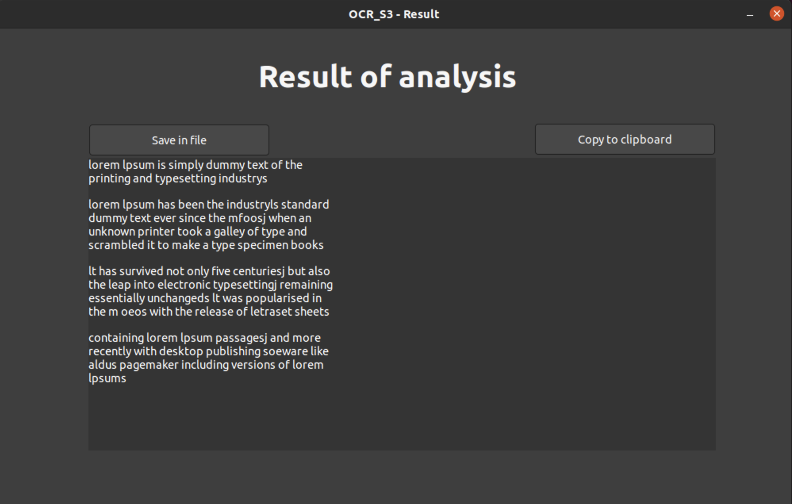

# OCR_S3

An OCR (Optical Character Recognition) made in C with a neural network and image treatment.

Made for EPITA S3 Project.

## Compilation
### Prerequisite

The project only works on Unix or MacOS.

To compile you needs : **SDL2-dev, SDL2-image-dev, GTK3-dev**

### Apt package manager

```sh
$ sudo apt install libsdl2-dev
$ sudo apt install libsdl2-image-dev
$ sudo apt install libgtk3-dev
```

### Compilation
```sh
$ cmake -B build
$ cd build
$ make
$ cd ..
$ ./build/OCR_S3
```

(You need to have the ui_glade folder in the environnement to start the OCR)

## Screenshots



